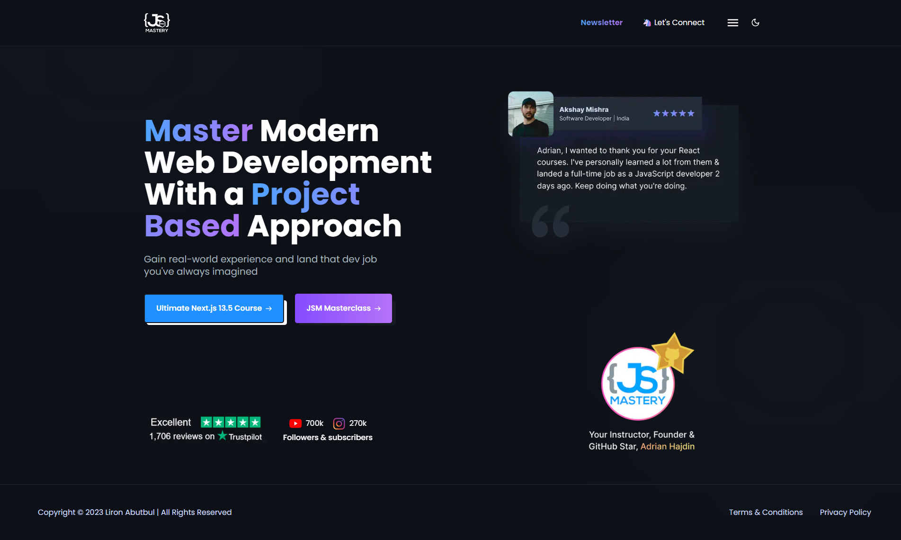

<a name="readme-top"></a>

<div align="center">


<br />
<br />

[](https://github.com/ladunjexa)
[](https://github.com/ladunjexa/nextjs13-jsmastery/blob/main/LICENSE)
[](https://github.com/ladunjexa/nextjs13-jsmastery/graphs/contributors)

[](https://github.com/ladunjexa/nextjs13-jsmastery/network/members)
[](https://github.com/ladunjexa/nextjs13-jsmastery/stargazers)
[](https://github.com/ladunjexa/nextjs13-jsmastery/issues/)
[](https://github.com/ladunjexa/nextjs13-jsmastery/issues/)

### JSMastery.pro Clone

</div>

Dive into the world of Next.js, Incredible JSMastery.pro replica website built with Next.js using TypeScript & Tailwind CSS 🪐

#### [View Demo](https://nextjs13-jsmastery.vercel.app/)

## Table of Contents

- [Table of Contents](#table-of-contents)
- [:star2: Introduction](#star2-introduction)
  - [Folder Structure](#folder-structure)
- [:space_invader: Technologies Used](#space_invader-technologies-used)
- [:toolbox: Getting Started](#toolbox-getting-started)
  - [:gear: Installation and Run Locally](#gear-installation-and-run-locally)
    - [Step 1](#step-1)
    - [Step 2](#step-2)
    - [Step 3](#step-3)
    - [Step 4](#step-4)
  - [Learn More](#learn-more)
  - [Deploy on Vercel](#deploy-on-vercel)
- [:camera: Screenshots](#camera-screenshots)
- [:wave: Contributing](#wave-contributing)
- [:warning: License](#warning-license)
- [:handshake: Contact](#handshake-contact)

## :star2: Introduction

This repository houses an amazing Next.js 13 Application which simulates the JSMastery.pro web application using Next.js, TypeScript, and TailwindCSS,combining powerful tools to deliver a responsive and user-friendly experience. The application is deployed on Vercel.

### Folder Structure

<b>JSMastery</b> code folder structure is as follows:

```
nextjs13-jsmastery/
├── .vscode/
├   └── settings.json
├── app/
├   ├── (root)/
├   ├   ├── (home)/
├   ├   ├   └── page.tsx
├   ├   ├── resources/
├   ├   ├   ├── [id]/
├   ├   ├   ├   └── page.tsx
├   ├   ├   ├── loading.tsx
├   ├   ├   └── page.tsx
├   ├   ├── videos/
├   ├   ├   ├── loading.tsx
├   ├   ├   └── page.tsx
├   ├   ├── newsletter/
├   ├   ├   └── page.tsx
├   ├   ├── privacy-policy/
├   ├   ├   └── page.tsx
├   ├   ├── terms-of-use/
├   ├   ├   └── page.tsx
├   ├   └── layout.tsx
├   ├── studio/[[...index]]/
├   ├   └── page.tsx
├   ├── favicon.ico
├   ├── globals.css
├   ├── layout.tsx
├   └── page.tsx
├── components/
├   ├── atoms/
├   ├   ├── Arrow.tsx
├   ├   ├── DownloadButton.tsx
├   ├   ├── Header.tsx
├   ├   └── NextJsLogo.tsx
├   ├── home/
├   ├   └── Testimonials.tsx
├   ├── shared/
├   ├   ├── Footer.tsx
├   ├   ├── Navbar.tsx
├   ├   └── Theme.tsx
├   ├── newsletter/
├   ├   └── Countdown.tsx
├   ├── newsletter/
├   ├   ├── ContentCard.tsx
├   ├   ├── Document.tsx
├   ├   ├── Dropdown.tsx
├   ├   ├── Filters.tsx
├   ├   └── SearchForm.tsx
├   └── ui/
├       ├── accordion.tsx
├       ├── button.tsx
├       ├── card.tsx
├       ├── dropdown-menu.tsx
├       ├── input.tsx
├       └── skeleton.tsx
├── constants/
├   └── index.ts
├── context/
├   └── ThemeProvider.tsx
├── lib/
├   └── utils.ts
├── public/
├   └── assets/
├   ├   ├── icons/
├   ├   ├   └── [[...]].svg
├   ├   └── images/
├   ├       └── [[...]].{png,svg}
├   ├── next.svg
├   └── vercel.svg
├── sanity/
├   ├── lib/
├   ├   ├── client.ts
├   ├   └── image.ts
├   ├── schemas/
├   ├   ├── index.ts
├   ├   ├── resource-playlist.schema.ts
├   ├   ├── resource.schema.ts
├   ├   ├── video-playlist.schema.ts
├   ├   └── video.schema.ts
├   ├── actions.ts
├   ├── env.ts
├   └── utils.ts
├── types/
├   └── index.d.ts
├── .eslintrc.json
├── components.json
├── next.config.js
├── package.json
├── postcss.config.js
├── tailwind.config.ts
├── sanity.cli.ts
├── sanity.config.ts
└── tsconfig.json
```

## :space_invader: Technologies Used

Hilink web application is built using the following technologies:

- [React](https://reactjs.org/): React is an open-source, front end, JavaScript library for building user interfaces or UI components.
- [TypeScript](https://www.typescriptlang.org/): TypeScript is a typed superset of JavaScript that compiles to plain JavaScript.
- [Next.js](https://nextjs.org/): Next.js is an open-source React front-end development web framework created by Vercel that enables functionality such as server-side rendering and generating static websites for React based web applications.
- [Sanity](https://www.sanity.io/): Sanity is the platform for structured content that lets you build better digital experiences and scale faster.
- [shadcn/ui](ui.shadcn.com): A collection of accessible, reusable, and composable React components for faster and easier web development.
- [Tailwind CSS](https://tailwindcss.com/): Tailwind CSS is a utility-first CSS framework for rapidly building custom user interfaces.
- [ESLint](https://eslint.org/): ESLint is a static code analysis tool for identifying problematic patterns found in JavaScript code.
- [Prettier](https://prettier.io/): Prettier is an opinionated code formatter.
- [Vercel](https://vercel.com/): Vercel is a cloud platform for frontend developers, providing the frameworks, workflows, and infrastructure to build a faster, more personalized Web.

[](https://skillicons.dev)

<p align="right">(<a href="#readme-top">back to top</a>)</p>

## :toolbox: Getting Started

<!-- Installation -->

### :gear: Installation and Run Locally

#### Step 1

Download or clone this repo by using the link below:

```bash
 https://github.com/ladunjexa/nextjs13-jsmastery.git
```

#### Step 2

**JSMastery** clone using NPM (Node Package Manager), therefore, make sure that Node.js is installed by execute the following command in consle

```bash
  node -v
```

#### Step 3

Go to root folder and execute the following command in console to get nodemon the required packages:

```bash
npm install
```

#### Step 4

Go to root folder and execute the following command in console to start the application locally:

```bash
npm run dev
```

This is a [Next.js](https://nextjs.org/) project bootstrapped with [`create-next-app`](https://github.com/vercel/next.js/tree/canary/packages/create-next-app).

### Learn More

To learn more about Next.js, take a look at the following resources:

- [Next.js Documentation](https://nextjs.org/docs) - learn about Next.js features and API.
- [Learn Next.js](https://nextjs.org/learn) - an interactive Next.js tutorial.

You can check out [the Next.js GitHub repository](https://github.com/vercel/next.js/) - your feedback and contributions are welcome!

### Deploy on Vercel

The easiest way to deploy your Next.js app is to use the [Vercel Platform](https://vercel.com/new?utm_medium=default-template&filter=next.js&utm_source=create-next-app&utm_campaign=create-next-app-readme) from the creators of Next.js.

Check out our [Next.js deployment documentation](https://nextjs.org/docs/deployment) for more details.

<p align="right">(<a href="#readme-top">back to top</a>)</p>

## :camera: Screenshots



<p align="right">(<a href="#readme-top">back to top</a>)</p>

## :wave: Contributing

<a href="https://github.com/ladunjexa/Rainblur-Portfolio-Showcase/graphs/contributors">
  
</a>

Contributions are always welcome!

See [`contributing.md`](https://contributing.md/) for ways to get started.

Contributions are what make the open source community such an amazing place to learn, inspire, and create. Any contributions you make are **greatly appreciated**.

If you have a suggestion that would make this better, please fork the repo and create a pull request. You can also simply open an issue with the tag "enhancement".
Don't forget to give the project a star! Thanks again!

1. Fork the Project
2. Create your Feature Branch (`git checkout -b feature/AmazingFeature`)
3. Commit your Changes (`git commit -m 'Add some AmazingFeature'`)
4. Push to the Branch (`git push origin feature/AmazingFeature`)
5. Open a Pull Request

<p align="right">(<a href="#readme-top">back to top</a>)</p>

## :warning: License

_Hilink_ web application is open source and distributed under the [MIT License](https://github.com/ladunjexa/nextjs13-jsmastery/blob/main/LICENSE).

<p align="right">(<a href="#readme-top">back to top</a>)</p>

## :handshake: Contact

If you want to contact me, you can reach me at [@ladunjexa](https://t.me/ladunjexa).

<p align="right">(<a href="#readme-top">back to top</a>)</p>
